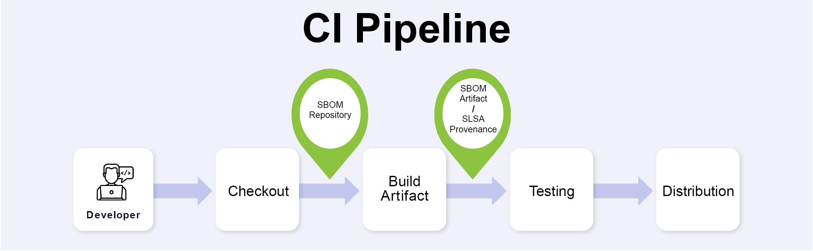

# Setting up Scribe protection in your CI pipeline

Adding Scribe Hub code snippets to your Continuous Integration (CI) pipeline automates the process of generating SBOMs and analysis reports for your builds.

The following scheme demonstrates the points on your CI pipeline to enter the Scribe Hub code snippets:

Scribe installation includes Command Line Interpreter (CLI) tools. Scribe provides the following CLI tools: 
* **Gensbom**: An SBOM Generator 
* **Valint**: A validator and integrity checker for your Node.js projects and NPM files/packages. It's used to download the integrity report created by the Scribe system.

## Gensbom - Creating your SBOM
*Gensbom* is the Scribe tool used to collect evidence and generate an SBOM.

The simplest integration is to automate calling *Gensbom* to collect evidence of the repository and create an SBOM of the final image. The evidence and SBOM are then automatically uploaded to Scribe Hub. 
While *Gensbom* does have other capabilities and CLI options, we will focus on its basic usage.

<!--You can read more about *Gensbom* [here](../CLI/gensbom "Gensbom documentation").-->
<!-- 
## Valint - Fetching your integrity report

*Valint* is a Scribe tool used to validate the code integrity of your project and open-source dependencies.  

[Here's](../CLI/valint/report "Valint report") an example of a `valint` report. The important information would be in __source_code > summary__ and __open_source > summary__. Essentially, you'll see how many files/packages were there, and how many of those were validated. It's up to you to decide how many mismatched or modified files are still considered OK for your particular build. 

Currently, our release validates only Node.js projects and NPM files/packages (dependencies).
Integrity validation is based on evidence collected from your pipeline.
At the end of your pipeline run you may decide to accept or fail a build, depending on the integrity analysis result reported by Scribe as downloaded by *Valint*. Using *Valint* is ___optional___ and completely at your discretion. 

You can read more about *Valint* [here](../CLI/valint "Valint documentation"). -->

## Where to place Scribe Code in your pipeline 
Regarding *Gensbom*, these are the two points for adding the code snippet:
* **Source Code Checkout**: Collects evidence of your Node.js source code files after checkout. This is an important but ___optional___ point.

* **Final built image**: Generates an SBOM right after the final image is created. This is the main and ___mandatory___ point.

Regarding *Valint*, you would probably want to call it at the end of your pipeline, after all the other tests have passed/failed. You can choose to use the *Valint* report as an additional data point for a Build pass/fail decision. 

___Note___ that if you do not collect evidence about your source code using *Gensbom*, you cannot get integrity information about your code. You can get integrity information about your NPM dependencies regardless of localized evidence collection.   

## Supported CIs

Currently, Scribe natively supports the following CI setups:
* [Jenkins](../ci-integrations/jenkins "Jenkins"). 
* [Github Actions](../ci-integrations/github "GitHub actions").
* [GitLab](../ci-integrations/gitlabci "GitLab").

If you have another CI, you can integrate it using these [generic integration instructions](../ci-integrations/general "generic integration instructions").  

