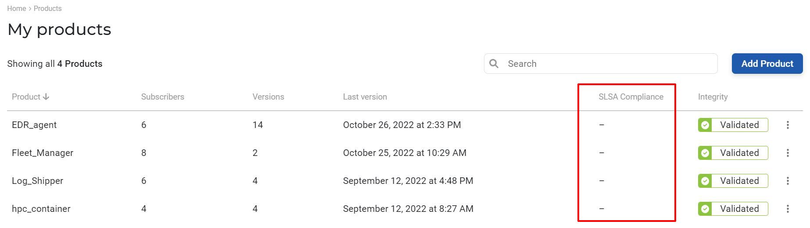

# Integrating Scribe in your GitHub pipeline 

If you are using GitHub as your Continuous Integration tool (CI), use these quick start instructions to integrate Scribe into your pipeline to protect your projects. This is the simplified quick-start guide. To learn more about Scribe's tool GitHub capabilities check out the following GitHub actions documentation links:
* [bom](action-bom.md)
* [verify](action-verify.md)
* [installer](action-installer.md)

## Before you begin
### Acquiring credentials from Scribe Hub
Integrating Scribe Hub with GitHub actions requires the following credentials that are found in the product setup dialog. (In your **[Scribe Hub](https://prod.hub.scribesecurity.com/ "Scribe Hub Link")** go to **Home>Products>[$product]>Setup**)

* **Product Key**
* **Client ID**
* **Client Secret**

>Note that the product key is unique per product, while the client ID and secret are unique for your account.

## Creating an SBOM and collecting evidence
1. Add the credentials according to the [GitHub instructions](https://docs.github.com/en/actions/security-guides/encrypted-secrets/ "GitHub Instructions"). Based on the code example below, be sure to call the secrets **clientid** for the **client-id**, **clientsecret** for the           **client-secret** and **productkey** for the **product-key**.
2. Add Code snippets to your pipeline from your GitHub flow:   
    * Replace the `Mongo express` repo in the example with your repo name.
    ```YAML
      target: <repo-name>
    ```
    * Call `valint` right after checkout to collect hash value evidence of the source code files.
    ```YAML
      - name: Scm generate bom, upload to scribe
        id: valint_bom_scm
        uses: scribe-security/action-bom@master
        with:
          type: dir
          target: <repo-name>
          verbose: 2
          scribe-enable: true
          scribe-client-id: ${{ secrets.clientid }}
          scribe-client-secret: ${{ secrets.clientsecret }}
          product-key: ${{ secrets.productkey }}
    ```
    * Call `valint` to generate an SBOM from the final Docker image.
    ```YAML
        - name: Image generate bom, upload to scribe
        id: valint_bom_image
        uses: scribe-security/action-bom@master
        with:
          type: docker # To be included only if you want to to use docker daemon to access the image (for example, creating your docker image locally)
          target: <image-name:tag>
          verbose: 2
          scribe-enable: true
          scribe-client-id: ${{ secrets.clientid }}
          scribe-client-secret: ${{ secrets.clientsecret }}
          product-key: ${{ secrets.productkey }}
    ```
    <!-- * Call `valint` to get the integrity report results.
    ```YAML
        - name: Valint - download report
        id: valint_report
        uses: scribe-security/action-report@master
        with:
           verbose: 2
           scribe-enable: true
           scribe-client-id: ${{ secrets.clientid }}
           scribe-client-secret: ${{ secrets.clientsecret }}
           product-key: ${{ secrets.productkey }}
    ```
    Note that the `valint` report will be downloaded to where you have determined in the `valint_report.outputs.OUTPUT_PATH` in the `scribe-reports` step (the last step in the example pipeline).  -->

Here's the full example pipeline:

```YAML
name: example workflow

on: 
  push:
    tags:
      - "*"

jobs:
  scribe-report-test:
    runs-on: ubuntu-latest
    steps:

      - uses: actions/checkout@v2
        with:
          fetch-depth: 0

      - uses: actions/checkout@v3
        with:
          repository: mongo-express/mongo-express
          ref: refs/tags/v1.0.0-alpha.4
          path: mongo-express-scm

      - name: Scm generate bom, upload to scribe
        id: valint_bom_scm
        uses: scribe-security/action-bom@master
        with:
           type: dir
           target: 'mongo-express-scm'
           verbose: 2
           scribe-enable: true
           scribe-client-id: ${{ secrets.clientid }}
           scribe-client-secret: ${{ secrets.clientsecret }}
           product-key: ${{ secrets.productkey }}

      # Build and push your image - this example skips this step as we're using the published mongo express.

      - name: Image generate bom, upload to scribe
        id: valint_bom_image
        uses: scribe-security/action-bom@master
        with:
          type: docker # To be included only if you want to to use docker daemon to access the image (for example, creating your docker image locally)
           target: 'mongo-express:1.0.0-alpha.4'
           verbose: 2
           scribe-enable: true
           scribe-client-id: ${{ secrets.clientid }}
           scribe-client-secret: ${{ secrets.clientsecret }}
           product-key: ${{ secrets.productkey }}

      - uses: actions/upload-artifact@v2
        with:
          name: scribe-reports
          path: |
            ${{ steps.valint_bom_scm.outputs.OUTPUT_PATH }}
            ${{ steps.valint_bom_image.outputs.OUTPUT_PATH }}
```

## Generating SLSA provenance

To collect SLSA provenance from your GitHub pipeline you'll first need to install the Scribe GitHub app in your organizational GitHub account. You'll then need to add the relevant code snippet to your pipeline.

### Connecting your GitHub account to ScribeApp

Start by visiting your **[Scribe Hub account](https://prod.hub.scribesecurity.com/ "Scribe Hub Link")**. You'll see that the **SLSA compliance** column is empty for all your products.



To add the SLSA policies go to any of your product's pages and note the tab **policies**.

 

Once you click on the **policies** tab you'll get to this page:

 

The first step in activating the policies is connecting your organizational GitHub account to the Scribe GitHub app - ScribeApp. Once you press the link you'll get to the **integrations** page:


To continue press the **connect** link designed to connect ScribeApp to your GitHub organization's account. That will lead you to a page like this:


Choose the GitHub account you want to integrate the ScribeApp with. Make sure you have owner access to the account to allow the app integration.
Make sure the account is organizational - the integration won't work with a private account.

Once you have chosen the account you wish to integrate with ScribeApp GitHub will present the following window. 


Choose the access level you wish to grant ScribeApp. You can choose to allow it access to all repositories or just select repositories. Note that repositories that are not covered by the ScribeApp will not be able to produce the SLSA provenance. 

After reviewing the access granted to ScribeApp go ahead and approve it by pressing the big green button.

 

Next, you'll be directed to GitHub to approve your access by inputting your password. 


As soon as you provide your password GitHub will handle everything else and redirect you back to the **integrations** page. Note that now there is a green checkmark next to the GitHub icon:

 

You can now go back to the product's **policies** tab and activate the policies by pressing the **Active** button.

 

You can turn the policies off or on for each project at any time, assuming that the project's repository is covered by ScribeApp. Note that even if you have turned on the policies you won't see any SLSA provenance results until you have integrated Scribe's code snippet into your pipeline and have run a new build.

If anything isn't clear you can check out the GitHub instruction page for <a href='https://docs.github.com/en/developers/apps/managing-github-apps/installing-github-apps'>installing GitHub Apps</a>.

### Generating the SLSA provenance in your pipeline

1. Add the credentials according to the [GitHub instructions](https://docs.github.com/en/actions/security-guides/encrypted-secrets/ "GitHub Instructions"). Based on the code example below, be sure to call the secrets **clientid** for the **client-id**, **clientsecret** for the           **client-secret** and **productkey** for the **product-key**.
2. Add the Code snippet to your pipeline from your GitHub flow:   
    * Replace the `Mongo express` repo in the example with your repo name.
    ```YAML
      target: <repo-name>
    ```
    * Call `valint` to generate SLSA provenance from the final Docker image.
    ```YAML
        - name: Generate SLSA provenance statement
        id: valint_slsa_statement
        uses: scribe-security/action-bom@master
        with:
          target: <image-name:tag>
          format: statement-slsa
          scribe-client-id: ${{ secrets.clientid }}
          scribe-client-secret: ${{ secrets.clientsecret }}
          product-key: ${{ secrets.productkey }}

Here's the full example pipeline:

```YAML
name: example workflow

on: 
  push:
    tags:
      - "*"

jobs:
  scribe-report-test:
    runs-on: ubuntu-latest
    steps:

      - uses: actions/checkout@v2
        with:
          fetch-depth: 0

      - uses: actions/checkout@v3
        with:
          repository: mongo-express/mongo-express
          ref: refs/tags/v1.0.0-alpha.4
          path: mongo-express-scm

      - name: Generate SLSA provenance statement
        id: valint_slsa_statement
        uses: scribe-security/action-bom@master
        with:
          target: mongo-express:1.0.0-alpha.4
          format: statement-slsa
          scribe-client-id: ${{ secrets.clientid }}
          scribe-client-secret: ${{ secrets.clientsecret }}
          product-key: ${{ secrets.productkey }

      -uses: actions/upload-artifact@v2
      with:
        name: provenance
        path: ${{ steps.valint_slsa_statement.outputs.OUTPUT_PATH }}
```

Note that at this time you cannot generate both SLSA provenance and an SBOM at the same time. 