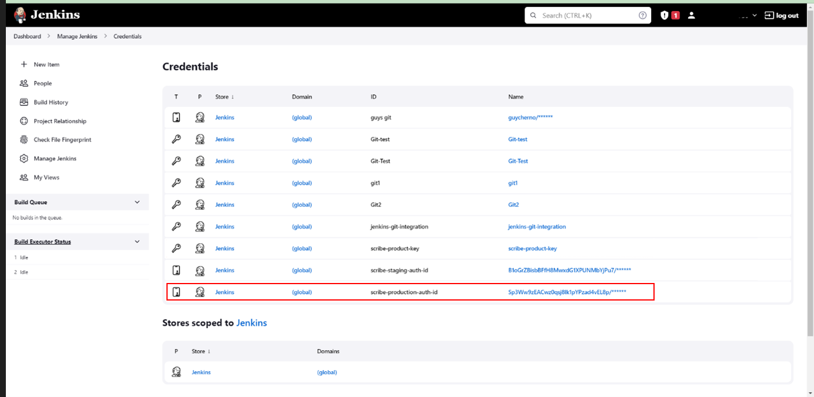

# Integrating Scribe in your Jenkins pipeline 

If you are using Jenkins as your Continuous Integration tool (CI), use these instructions to integrate Scribe into your pipeline to protect your projects.

## Before you begin
### Acquiring credentials from Scribe Hub
Integrating Scribe Hub with Jenkins requires the following credentials that are found in the product setup dialog. (In your **[Scribe Hub](https://prod.hub.scribesecurity.com/ "Scribe Hub Link")** go to **Home>Products>[$product]>Setup**)

* **Client ID**
* **Client Secret**

### Adding Credentials to Jenkins

1. Go to your Jenkins Web Console.
1. Select **Dashboard> Manage Jenkins> Manage credentials (under Security options)**.
1. Go to the Global Credential setup: click on any one of the clickable **Global** Domains in the **Domain** column.
1. To add Client ID and Client Secret, in the **Global credentials** area, click **+ Add Credentials**.
A new **Credentials** form opens.
1. In the **Kind** field, select **Username with password**.

1. Set **ID** to **`scribe-production-auth-id`** (lowercase).
1. Copy the *Client ID* provided by Scribe to the **Username**.
1. Copy the *Client Secret* provided by Scribe to the **Password**.
1. Leave **Scope** as **Global**.
1. Click **Create**.
1. Another Global credential is created as a **Username with Password** (Kind)


The final state of the secrets definition should be as shown in the following screenshot:

 

### Avoiding costly commits
To avoid potentially costly commits, we recommended adding the Scribe output directory to your .gitignore file.
By default, add `**/scribe` to your .gitignore.

<!---
### Using Jenkins Shared Library (JSL)

Use JSL to ease your integration. 
Read [Scribe JSL Documentation](./JSL/) for instructions.
-->

## Procedure
Scribe installation includes Command Line Interpreter (CLI) tools. Scribe provides the following a CLI tool called **Valint**. This tool is used to generate evidence in the form of SBOMs as well as SLSA provenance.  

Every integration pipeline is unique. 
Integrating Scribe's code into your pipeline varies from one case to another.

The following are examples that illustrate where to add Scribe code snippets. 

The code in these examples of a workflow executes these steps:
1. Calls `valint` right after checkout to collect hash value evidence of the source code files and upload the evidence.
2. Calls `valint` to generate an SBOM from the final Docker image and upload the evidence.
 
The examples use a sample pipeline building a Mongo express project. 
<details>
  <summary> <b> Jenkins over Docker </b>
  </summary>
<h3>  Prerequisites </h3>

* Jenkins extensions installed:
   1. [Docker pipeline](https://plugins.jenkins.io/docker-workflow/ "Docker Pipeline extension")
   1. [Docker commons](https://plugins.jenkins.io/docker-commons/ "Docker Commons extension")
   1. [Docker plugin](https://plugins.jenkins.io/docker-plugin/ "Docker plugin extension" )
   1. [Docker API](https://plugins.jenkins.io/docker-java-api/ "Docker API extension")
   1. [Workspace Cleanup](https://plugins.jenkins.io/ws-cleanup/ "Workspace Cleanup extension") (optional)

* A `docker` is installed on your build node in Jenkins.

### Procedure

<details>
  <summary>  <b> Sample integration code </b> </summary>


```javascript
pipeline {
  agent any
  stages {
    stage('checkout') {
      steps {
          cleanWs()
          sh 'git clone -b v1.0.0-alpha.4 --single-branch https://github.com/mongo-express/mongo-express.git mongo-express-scm'
      }
    }
    
    stage('sbom') {
      agent {
        docker {
          image 'scribesecuriy.jfrog.io/scribe-docker-public-local/valint:latest'
          reuseNode true
          args "--entrypoint="
        }
      }
      steps {        
        withCredentials([usernamePassword(credentialsId: 'scribe-staging-auth-id', usernameVariable: 'SCRIBE_CLIENT_ID', passwordVariable: 'SCRIBE_CLIENT_SECRET')]) {
        sh '''
            valint bom dir:mongo-express-scm \
            --context-type jenkins \
            --output-directory ./scribe/valint \
            -E -U $SCRIBE_CLIENT_ID -P $SCRIBE_CLIENT_SECRET
          '''
        }
      }
    }

    stage('image-bom') {
      agent {
        docker {
          image 'scribesecuriy.jfrog.io/scribe-docker-public-local/valint:latest'
          reuseNode true
          args "--entrypoint="
        }
      }
      steps {
            withCredentials([usernamePassword(credentialsId: 'scribe-staging-auth-id', usernameVariable: 'SCRIBE_CLIENT_ID', passwordVariable: 'SCRIBE_CLIENT_SECRET')]) {  
            sh '''
            valint bom mongo-express:1.0.0-alpha.4 \
            --context-type jenkins \
            --output-directory ./scribe/valint \
            -E -U $SCRIBE_CLIENT_ID -P $SCRIBE_CLIENT_SECRET
            '''
          }
      }
    }
  }
}
```

</details>


### See Also
[Jenkins over Docker documentation](https://plugins.jenkins.io/docker-plugin/)
</details>


<details>
  <summary> <b> Jenkins over Kubernetes (K8s) </b>
  </summary>

  <h3>  Prerequisites </h3>

[Jenkins over Kubernetes](https://plugins.jenkins.io/kubernetes/ "Jenkins over Kubernetes extension") installed.
### Procedure

<details>
  <summary>  <b> Sample integration code </b> </summary>


```javascript
pipeline {
  agent {
    kubernetes {
      yamlFile 'jenkins/k8s/scribe-test/KubernetesPod.yaml'
    }
  }
  stages {
    stage('checkout-bom') {
      steps {        
        container('git') {
          sh 'git clone -b v1.0.0-alpha.4 --single-branch https://github.com/mongo-express/mongo-express.git mongo-express-scm'
        }
        
        container('valint') {
          withCredentials([usernamePassword(credentialsId: 'scribe-staging-auth-id', usernameVariable: 'SCRIBE_CLIENT_ID', passwordVariable: 'SCRIBE_CLIENT_SECRET')]) {
            sh '''
            valint bom dir:mongo-express-scm \
            --context-type jenkins \
            --output-directory ./scribe/valint \
            -E -U $SCRIBE_CLIENT_ID -P $SCRIBE_CLIENT_SECRET'''
          }
        }
      }
    }

    stage('image-bom') {
      steps {
        container('valint') {
           withCredentials([usernamePassword(credentialsId: 'scribe-staging-auth-id', usernameVariable: 'SCRIBE_CLIENT_ID', passwordVariable: 'SCRIBE_CLIENT_SECRET')]) {  
            sh '''
            valint bom mongo-express:1.0.0-alpha.4 \
            --context-type jenkins \
            --output-directory ./scribe/valint \
            -E -U $SCRIBE_CLIENT_ID -P $SCRIBE_CLIENT_SECRET'''
          }
        }
      }
    }
  }
}
```
This example uses Jenkins over k8s plugin with the Pod template defined like this:
```YAML
metadata:
  labels:
    some-label: jsl-scribe-test
spec:
  containers:
  - name: jnlp
    env:
    - name: CONTAINER_ENV_VAR
      value: jnlp
  - name: valint
    image: scribesecuriy.jfrog.io/scribe-docker-public-local/valint:latest 
    command:
    - cat
    tty: true
  - name: git
    image: alpine/git
    command:
      - cat
    tty: true
```
</details>

### See Also
[Jenkins over Kubernetes documentation](https://plugins.jenkins.io/kubernetes/)

</details>


<details>
  <summary> <b> Jenkins Vanilla (No Agent) </b>
  </summary>
<h3>  Prerequisites </h3>

 `curl` installed on your build node in jenkins.
### Procedure

<details>
  <summary>  <b> Sample integration code </b> </summary>

```javascript
pipeline {
  agent any
  environment {
    PATH="./temp/bin:$PATH"
  }
  stages {
    stage('install') {
        steps {
          cleanWs()
          sh 'curl -sSfL https://raw.githubusercontent.com/scribe-security/misc/master/install.sh | sh -s -- -b ./temp/bin'
        }
    }
    stage('checkout') {
      steps {
          sh 'git clone -b v1.0.0-alpha.4 --single-branch https://github.com/mongo-express/mongo-express.git mongo-express-scm'
      }
    }
    
    stage('sbom') {
      steps {        
        withCredentials([usernamePassword(credentialsId: 'scribe-staging-auth-id', usernameVariable: 'SCRIBE_CLIENT_ID', passwordVariable: 'SCRIBE_CLIENT_SECRET')]) {
        sh '''
            valint bom dir:mongo-express-scm \
            --context-type jenkins \
            --output-directory ./scribe/valint \
             -E -U $SCRIBE_CLIENT_ID -P $SCRIBE_CLIENT_SECRET'''
        }
      }
    }

    stage('image-bom') {
      steps {
            withCredentials([usernamePassword(credentialsId: 'scribe-staging-auth-id', usernameVariable: 'SCRIBE_CLIENT_ID', passwordVariable: 'SCRIBE_CLIENT_SECRET')]) {  
            sh '''
            valint bom mongo-express:1.0.0-alpha.4 \
            --context-type jenkins \
            --output-directory ./scribe/valint testing \
            -E -U $SCRIBE_CLIENT_ID -P $SCRIBE_CLIENT_SECRET'''
          }
      }
    }
  }
}

```

</details>
</details>


