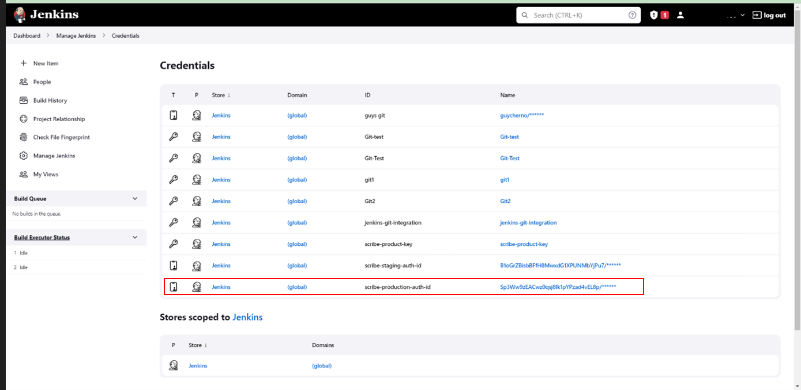

# Integrating Scribe in your Jenkins pipeline 

If you are using Jenkins as your Continuous Integration tool (CI), use these instructions to integrate Scribe into your pipeline to protect your projects.

## Before you begin
### Acquiring credentials from ScribeHub
Integrating Scribe Hub with Jenkins requires the following credentials that are found in the product setup dialog. (In your **[Scribe Hub](https://prod.hub.scribesecurity.com/ "Scribe Hub Link")** go to **Home>Products>[$product]>Setup**)

* **Product Key**
* **Client ID**
* **Client Secret**

>Note that the product key is unique per product, while the client ID and secret are unique for your account.

### Adding Credentials to Jenkins

1. Go to your Jenkins Web Console.
1. Select **Dashboard> Manage Jenkins> Manage credentials (under Security options)**.
1. Go to the Global Credential setup: click on any one of the clickable **Global** Domains in the **Domain** column.
1. To add global credentials, in the **Global credentials** area, click **+ Add Credentials**.
A new **Credentials** form opens.
1.	To add the Product Key, in the **Kind** field, select **Secret Text**.
1.	Copy *Product Key* provided by Scribe to the **Secret** field.

1.	Set **ID** as **`scribe-product-key`** (lower case).
1.	Leave **Scope** as Global.
1. Add a helpful **Description** to manage your secrets.
1. Click **Create**. A New Global credential is created, as a **Secret Text** (Kind). A key sign on your new credential row indicates the secret **Kind**. 
1.	To add Client ID and Client Secret, click **+ Add Credentials** again.
1.	In the **Kind** field, select **Username with password**.

1. Set **ID** to **`scribe-production-auth-id`** (lower case).
1.	Copy *Client ID* provided by Scribe to  **Username**.
1.	Copy *Client Secret* provided by Scribe to  **Password**.
1.	Leave **Scope** as **Global**.
1.	Click **Create**.
1. Another Global credential is created as a  **Username with Password** (Kind)


The final state of the secrets definition should be as shown on the following screenshot:

 

### Avoiding costly commits
To avoid potentially costly commits, we recommended adding the Scribe output directory to your .gitignore file.
By default, add `**/scribe` to your .gitignore.


### Using Jenkins Shared Library (JSL)

Use JSL to ease your integration. 
Read [Scribe JSL Documentation](./JSL/) for instructions.

## Procedure
Scribe installation includes the Command Line Interpreter (CLI) tools. Scribe provides the following CLI tools: 
* **Gensbom**: SBOM Generator 
* **Valint**: Validator and integrity checker for your supply chain.

Every integration pipeline is unique. 
Integrating Scribe code to your pipeline varies from one case to another.

The following are examples that illustrate where to add Scribe code snippets. 

The code in these examples of a workflow executes these three steps:
1. Calls `gensbom` to upload evidence.
1. Calls `valint` to  download report.
1. Attaches report and evidence to your pipeline run.
 
The examples use a sample pipeline building a Mongo express project. 
<details>
  <summary> <b> Jenkins over Docker </b>
  </summary>
<h3>  Pre requisites </h3>

* Jenkins extensions installed:
   1. [Docker pipeline](https://plugins.jenkins.io/docker-workflow/ "Docker Pipeline extension")
   1. [Docker commons](https://plugins.jenkins.io/docker-commons/ "Docker Commons extension")
   1. [Docker plugin](https://plugins.jenkins.io/docker-plugin/ "Docker plugin extension" )
   1. [Docker API](https://plugins.jenkins.io/docker-java-api/ "Docker API extension")
   1. [Workspace Cleanup](https://plugins.jenkins.io/ws-cleanup/ "Workspace Cleanup extension") (optional)

* A `docker` is installed on your build node in Jenkins.

### Procedure

<details>
  <summary>  <b>Code of Integration example </b> </summary>


```javascript
pipeline {
  agent any
  environment {
    SCRIBE_PRODUCT_KEY     = credentials('scribe-product-key')
  }
  stages {
    stage('checkout') {
      steps {
          cleanWs()
          sh 'git clone -b v1.0.0-alpha.4 --single-branch https://github.com/mongo-express/mongo-express.git mongo-express-scm'
      }
    }
    
    stage('sbom') {
      agent {
        docker {
          image 'scribesecuriy.jfrog.io/scribe-docker-public-local/gensbom:latest'
          reuseNode true
          args "--entrypoint="
        }
      }
      steps {        
        withCredentials([usernamePassword(credentialsId: 'scribe-staging-auth-id', usernameVariable: 'SCRIBE_CLIENT_ID', passwordVariable: 'SCRIBE_CLIENT_SECRET')]) {
        sh '''
            gensbom bom dir:mongo-express-scm \
            --context-type jenkins \
            --output-directory ./scribe/gensbom \
            --product-key $SCRIBE_PRODUCT_KEY \
            -E -U $SCRIBE_CLIENT_ID -P $SCRIBE_CLIENT_SECRET \
            -vv
          '''
        }
      }
    }

    stage('image-bom') {
      agent {
        docker {
          image 'scribesecuriy.jfrog.io/scribe-docker-public-local/gensbom:latest'
          reuseNode true
          args "--entrypoint="
        }
      }
      steps {
            withCredentials([usernamePassword(credentialsId: 'scribe-staging-auth-id', usernameVariable: 'SCRIBE_CLIENT_ID', passwordVariable: 'SCRIBE_CLIENT_SECRET')]) {  
            sh '''
            gensbom bom mongo-express:1.0.0-alpha.4 \
            --context-type jenkins \
            --output-directory ./scribe/gensbom \
            --product-key $SCRIBE_PRODUCT_KEY \
            -E -U $SCRIBE_CLIENT_ID -P $SCRIBE_CLIENT_SECRET \
            -vv'''
          }
      }
    }

    stage('download-report') {
      agent {
        docker {
          image 'scribesecuriy.jfrog.io/scribe-docker-public-local/valint:latest'
          reuseNode true
          args "--entrypoint="
        }
      }
      steps {
           withCredentials([usernamePassword(credentialsId: 'scribe-staging-auth-id', usernameVariable: 'SCRIBE_CLIENT_ID', passwordVariable: 'SCRIBE_CLIENT_SECRET')]) {  
            sh '''
            valint report \
            --product-key $SCRIBE_PRODUCT_KEY \
            -U $SCRIBE_CLIENT_ID -P $SCRIBE_CLIENT_SECRET --output-directory scribe/valint \
            --timeout 120s \
            -vv'''
          }
      }
    }
  }
}
```

</details>


### See Also
[See Jenkins over Docker documentation](https://plugins.jenkins.io/docker-plugin/)
</details>


<details>
  <summary> <b> Jenkins over Kubernetes (K8s) </b>
  </summary>

  <h3>  Prerequisites </h3>

[Jenkins over Kubernetes](https://plugins.jenkins.io/kubernetes/ "Jenkins over Kubernetes extension") installed.

<h3>  Code of Integration example  </h3>


```javascript
pipeline {
  agent {
    kubernetes {
      yamlFile 'jenkins/k8s/scribe-test/KubernetesPod.yaml'
    }
  }
  environment {
    SCRIBE_PRODUCT_KEY     = credentials('scribe-product-key')
  }
  stages {
    stage('checkout-bom') {
      steps {        
        container('git') {
          sh 'git clone -b v1.0.0-alpha.4 --single-branch https://github.com/mongo-express/mongo-express.git mongo-express-scm'
        }
        
        container('gensbom') {
          withCredentials([usernamePassword(credentialsId: 'scribe-staging-auth-id', usernameVariable: 'SCRIBE_CLIENT_ID', passwordVariable: 'SCRIBE_CLIENT_SECRET')]) {
            sh '''
            gensbom bom dir:mongo-express-scm \
            --context-type jenkins \
            --output-directory ./scribe/gensbom \
            -E -U $SCRIBE_CLIENT_ID -P $SCRIBE_CLIENT_SECRET \
            --product-key $SCRIBE_PRODUCT_KEY \
            -vv'''
          }
        }
      }
    }

    stage('image-bom') {
      steps {
        container('gensbom') {
           withCredentials([usernamePassword(credentialsId: 'scribe-staging-auth-id', usernameVariable: 'SCRIBE_CLIENT_ID', passwordVariable: 'SCRIBE_CLIENT_SECRET')]) {  
            sh '''
            gensbom bom mongo-express:1.0.0-alpha.4 \
            --context-type jenkins \
            --output-directory ./scribe/gensbom \
            -E -U $SCRIBE_CLIENT_ID -P $SCRIBE_CLIENT_SECRET \
            --product-key $SCRIBE_PRODUCT_KEY \
            -vv'''
          }
        }
      }
    }

    stage('download-report') {
      steps {
        container('valint') {
           withCredentials([usernamePassword(credentialsId: 'scribe-staging-auth-id', usernameVariable: 'SCRIBE_CLIENT_ID', )]) {  
            sh '''
            valint report \
            -U $SCRIBE_CLIENT_ID -P $SCRIBE_CLIENT_SECRET \
            --output-directory scribe/valint \
            -vv'''
          }
          publish()
        }
      }
    }
  }
}
```
Example uses Jenkins over k8s plugin, 
Pod template defined
```YAML
metadata:
  labels:
    some-label: jsl-scribe-test
spec:
  containers:
  - name: jnlp
    env:
    - name: CONTAINER_ENV_VAR
      value: jnlp
  - name: gensbom
    image: scribesecuriy.jfrog.io/scribe-docker-public-local/gensbom:latest 
    command:
    - cat
    tty: true
  - name: valint
    image: scribesecuriy.jfrog.io/scribe-docker-public-local/valint:latest
    command:
    - cat
    tty: true
  - name: git
    image: alpine/git
    command:
      - cat
    tty: true
```

### See Also
[See Jenkins documentation](https://plugins.jenkins.io/kubernetes/)

</details>


<details>
  <summary> <b> Jenkins Vanilla (No Agent) </b>
  </summary>
<h3>  Prerequisites </h3>

 `curl` installed on your build node in jenkins.

<h3> Code of Integration example</h3>

```javascript
pipeline {
  agent any
  environment {
    SCRIBE_PRODUCT_KEY     = credentials('scribe-product-key')
    PATH="./temp/bin:$PATH"
  }
  stages {
    stage('install') {
        steps {
          cleanWs()
          sh 'curl -sSfL https://raw.githubusercontent.com/scribe-security/misc/master/install.sh | sh -s -- -b ./temp/bin'
        }
    }
    stage('checkout') {
      steps {
          sh 'git clone -b v1.0.0-alpha.4 --single-branch https://github.com/mongo-express/mongo-express.git mongo-express-scm'
      }
    }
    
    stage('sbom') {
      steps {        
        withCredentials([usernamePassword(credentialsId: 'scribe-staging-auth-id', usernameVariable: 'SCRIBE_CLIENT_ID', passwordVariable: 'SCRIBE_CLIENT_SECRET')]) {
        sh '''
            gensbom bom dir:mongo-express-scm \
            --context-type jenkins \
            --output-directory ./scribe/gensbom \
            --product-key $SCRIBE_PRODUCT_KEY \
             -E -U $SCRIBE_CLIENT_ID -P $SCRIBE_CLIENT_SECRET \
            -vv
          '''
        }
      }
    }

    stage('image-bom') {
      steps {
            withCredentials([usernamePassword(credentialsId: 'scribe-staging-auth-id', usernameVariable: 'SCRIBE_CLIENT_ID', passwordVariable: 'SCRIBE_CLIENT_SECRET')]) {  
            sh '''
            gensbom bom mongo-express:1.0.0-alpha.4 \
            --context-type jenkins \
            --output-directory ./scribe/gensbom \
            --product-key testing \
            -E -U $SCRIBE_CLIENT_ID -P $SCRIBE_CLIENT_SECRET \
            -vv'''
          }
      }
    }

    stage('download-report') {
      steps {
           withCredentials([usernamePassword(credentialsId: 'scribe-staging-auth-id', usernameVariable: 'SCRIBE_CLIENT_ID', passwordVariable: 'SCRIBE_CLIENT_SECRET')]) {  
            sh '''
            valint report \
            --product-key $SCRIBE_PRODUCT_KEY \
            -U $SCRIBE_CLIENT_ID -P $SCRIBE_CLIENT_SECRET --output-directory scribe/valint \
            --timeout 120s \
            -vv'''
          }
      }
    }
  }
}

```

</details>


