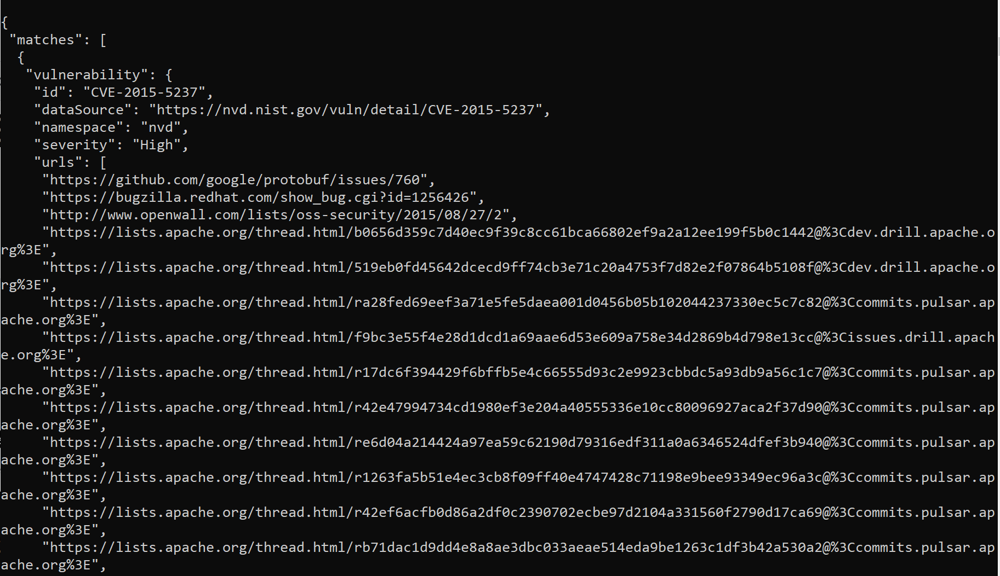

# Detecting CVEs

You can list all the Common Vulnerabilities and Exposures (CVEs) relevant to your software artifact as follows: 
1. Generate an SBOM with `gensbom`.
   
   SBOM can be generated automatically as part of your [pipeline integrated with Scribe](/docosaurus-scribe/docs/ci-integration "integrating Scribe in a pipeline"), or [manually](/docosaurus-scribe/docs/gensbomcli "Manually run gensbom from a CLI"). 
2. Use open-source tool [Grype](https://github.com/anchore/grype "Grype") on this SBOM. 
    
   You can run **grype** either offline or online. If you run offline, you need to update the tool frequently and suppress the automatic update.  

   In a Unix-based Command Line Interface (CLI) run:  
   ```sh    
   grype sbom:./image-sbom.json
   ```

  Where `image-sbom.json` is the name of your SBOM. Note that the SBOM should be saved as a JSON file. 

   Example output when no vulnerabilities are found:


   Example output when vulnerabilities are found:


For more details on the CVEs you can export the result as a JSON file:  
```sh
grype sbom:./image-sbom.json -o json
```
