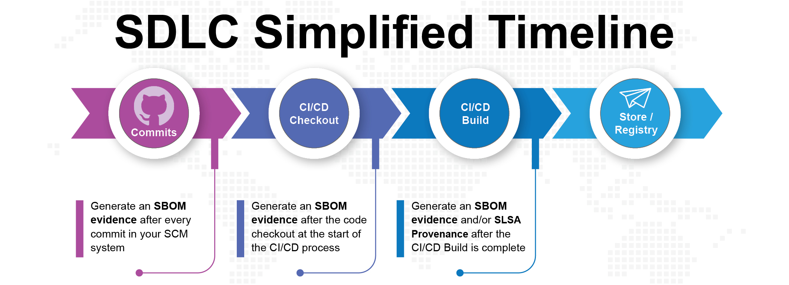

Adding code snippets to your Continuous Integration (CI) pipeline that call Scribe's tool, **Valint**, automates the process of generating SBOMs and analysis reports for your builds. You may also use Scribe's tool to generate SLSA provenance for your final artifact. If you're using GitHub then integrating the ScribeApp with your organizational GitHub account will allow you to get SSDF and SLSA compliance reports about your build.

The following scheme demonstrates the points on your CI pipeline to enter the code snippets calling Scribe's tool:

Scribe installation includes a Command Line Interpreter (CLI) tool called **Valint**. This tool is used to generate evidence in the form of SBOMs as well as SLSA provenance. 

### Creating an SBOM and collecting evidence

The simplest integration involves automating the use of *Valint* to gather evidence regarding your commits, repository checkout, and generate an SBOM for the final artifact. Scribe currently supports evidence collection from the following entities:

* Image - Supported image formats include Docker manifest v2 and Oracle Cloud Infrastructure (OCI) images. Images are commonly used as the final artifact.
* Folder - Collect evidence from a folder containing relevant files.
* File - Gather evidence from individual files.
* GIT repository - Gather evidence from a remote or local GIT repository.    

Once you generate the evidence in your SDLC or your pipeline it can then be automatically uploaded to Scribe Hub. 
While *Valint* does have other capabilities and CLI options, we will focus on its basic usage.
<!--You can read more about *Gensbom* [here](../CLI/gensbom "Gensbom documentation").-->

### Generating SLSA provenance

At this time Scribe's tool can be used to collect SLSA provenance only from a GitHub pipeline. To collect this provenance you'll need to connect the Scribe GitHub app to your GitHub organizational account and add the appropriate code snippet to your GitHub repositories' pipeline. You can find more details on the **[GitHub](../ci-integrations/github "GitHub")** integration quick-start page.

### Where to place Scribe's Code in your pipeline 
For the SBOM generation, these are the three points for adding the code snippet:
* **After each commit**: Collects evidence of your source code files after each commit. This is an ___optional___ step designed for source code integration checks.

* **Source Code Checkout**: Collects evidence of your source code files after checkout. This is an important but ___optional___ step. It's used to potentially check the integrity of your source code files when comparing this SBOM to the one created after the last commit.

* **Final built artifact**: Generates an SBOM right after the final artifact is created. This is the main and ___mandatory___ step. 

Note that you can generate an SBOM for various other entities as stated earlier. You can save and use these SBOMs at your discretion.

Regarding SLSA provenance generation, if relevant, it would be placed after the final artifact is created. 

___Note___ that if you do not collect evidence about your commits and source code, you cannot get integrity information about your code.   

### Supported CIs

Currently, Scribe natively supports the following CI setups:
* **[GitHub Actions](../ci-integrations/github "GitHub Actions")**.
* **[Jenkins](../ci-integrations/jenkins "Jenkins")**. 
* **[GitLab CI/CD](../ci-integrations/gitlabci "GitLab CI/CD")**.
* **[Azure Pipelines](../ci-integrations/azure "Azure Pipelines")**.
* **[CircleCI](../ci-integrations/circleci "CircleCI")**.
* **[Travis CI](../ci-integrations/travis "Travis CI")**.
* **[Bitbucket](../ci-integrations/bitbucket "Bitbucket")**.

If you have another CI, you can integrate it using these **[Generic CI integration instructions](../ci-integrations/general "Generic CI integration instructions")**. 