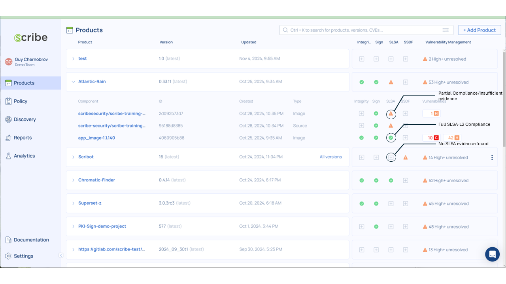
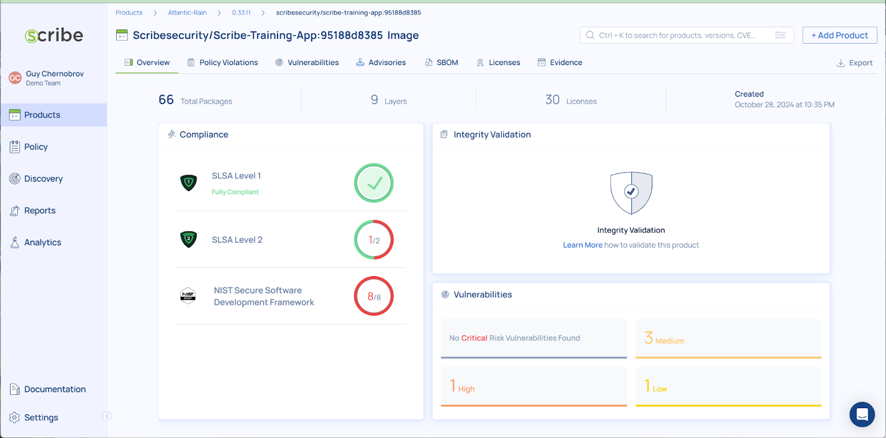
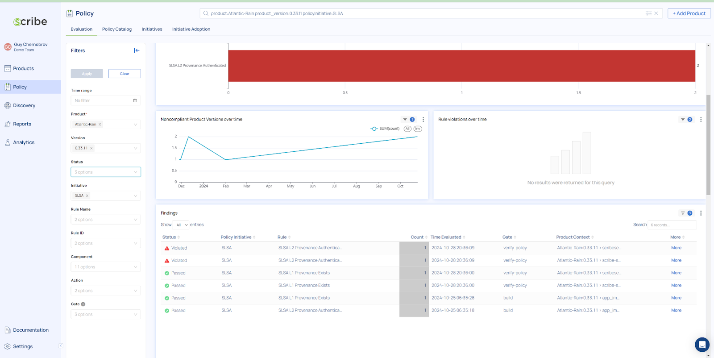

Nov 5, 2024

# How to use Scribe’s policy-as-code SLSA implementation?

Scribe supports the capability to verify the compliance of a build
pipeline to the SLSA L1 and SLSA L2 frameworks.

The basic requirements for SLSA L1 compliance is to have an automated
build system that generates a SLSA provenance record for the built
artifacts.

SLSA L2 adds the requirement for the provenance record to be
cryptographically verifiable and tamper resistant.

The level of SLSA compliance is represented in Scribe Hub in several
ways:

1.  On the product page - for each relevant component, a green checkmark 
will be shown once SLSA L2 compliance has been verified. The screenshot 
below shows the three possible SLSA indicators on the product page:



2.  On the component details page. The screenshot below shows an example
    of a component named scribe-training-app:95188d8385, which is a
    container image. This image has achieved SLSA L1 compliance, but
    not SLSA L-2, which means that it has a provenance record, but it
    is not properly signed.



3.  On the detailed policy report:



# Pipeline instrumentation

 This section details the necessary pipeline instrumentation in order
 to generate the types of reports shown above.

 The examples shown here are for a GitHub workflow, but the SLSA
 policy-as-code works in a similar way on any CI automation.

 The required instrumentation includes the following steps:

1.  Generate the required attestations:

    a.  Generate at least one SBOM from
    the pipeline.

    b. Generate a SLSA provenance record. For SLSA L2 compliance, this
        > record should be signed (i.e.,`format: attest`).

2.  Upload policy verification record regarding SLSA compliance:

    a.  Upload verification record for SLSA L1 compliance.

    b.  Upload verification record for SLSA L2 compliance.

> The example .yaml file below shows these steps:

Step 1-a Generate at least one SBOM from the pipeline.

  ```
  image-attest:
    runs-on: ubuntu-latest
    permissions:
      contents: read
      id-token: write
    steps:
    - name: Checkout repository
      uses: actions/checkout@v3
      with:
        fetch-depth: 0
    - name: Generate signed SBOM for docker image
      uses: scribe-security/action-bom@master
      with:
        target: ${{ env.DOCKER_USERNAME }}/scribe-training-app:${{ github.sha }}-${{github.run_number}}
        scribe-enable: true
        product-key: ${{ env.APP_NAME }}
        product-version: ${{env.PRODUCT_VERSION}}
        scribe-client-secret: ${{ secrets.SCRIBE_TOKEN }}
        format: attest
        config: .valint.yaml
 ```

Step 1-b Generate a SLSA provenance record (signed)

  ```
  generate-provenance:
    runs-on: ubuntu-latest
    permissions:
    contents: read
    id-token: write
    steps:
    - name: Checkout repository
      uses: actions/checkout@v3
      with:
        fetch-depth: 0
    - name: create slsa provenance
      id: slsa_provenance
      uses: scribe-security/action-slsa@master
      with:
        target: ${{ secrets.DOCKER_USERNAME }}/scribe-training-app:${{ github.sha }}-${{github.run_number}}
        scribe-enable: true
        product-key: ${{ env.APP_NAME }}
        product-version: ${{env.PRODUCT_VERSION}}
        scribe-client-secret: ${{ secrets.SCRIBE_TOKEN }}
        format: attest
        config: .valint.yaml
  ```

> Steps 2a,b Verify SLSA L1,L2 policies:

  ```
  verify-policy:
    runs-on: ubuntu-latest
    permissions:
    contents: read
    id-token: write
    steps:
    - name: Checkout repository
      uses: actions/checkout@v3
      with:
      fetch-depth: 0
    - name: verify slsa1
      id: slsa_ver1
      uses: scribe-security/action-verify@master
      with:
        target: ${{ secrets.DOCKER_USERNAME }}scribe-training-app:${{ github.sha }}-${{github.run_number}}
        scribe-enable: true
        product-key: ${{ env.APP_NAME }}
        product-version: ${{env.PRODUCT_VERSION}}
        scribe-client-secret: ${{ secrets.SCRIBE_TOKEN }}
        format: attest
        config: .valint.yaml
        rule: slsa/l1-provenance-exists@v1
        verbose: 2
      - name: verify slsa2
      
      id: slsa_ver2
      uses: scribe-security/action-verify@master
      with:
        target: ${{ secrets.DOCKER_USERNAME }}/scribe-training-app:${{ github.sha }}-${{github.run_number}}
        scribe-enable: true
        product-key: ${{ env.APP_NAME }}
        product-version: ${{env.PRODUCT_VERSION}}
        scribe-client-secret: ${{ secrets.SCRIBE_TOKEN }}
        format: attest
        config: .valint.yaml
        rule: slsa/l2-provenance-authenticated@v1
        verbose: 2
  ```

The verification stages use the SLSA policy-as-code definitions
(indicated by the rule: parameter). The verification can be done on a
separate pipeline (not necessarily the same pipeline that created the
attestations).

These definitions are published on the scribe public policy-as-code
repository, here:

[*https://github.com/scribe-public/sample-policies/tree/main/v1/slsa*](https://github.com/scribe-public/sample-policies/tree/main/v1/slsa)
